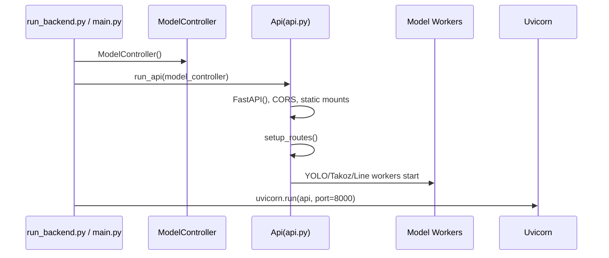

# Backend Runtime

Backend calisma zamani `run_backend.py` veya `main.py` uzerinden baslatilir.

## Baslatma sirasi

## Ana dosyalar

| Dosya | Rol |
| --- | --- |
| `run_backend.py` | Backend-only giris noktasi |
| `main.py` | Vite frontend ve backend'i birlikte calistirir |
| `Api/api.py` | FastAPI instance, CORS, route kayitlari, worker kurulumu |
| `Api/model_queue_worker.py` | Queue tabanli model worker |
| `Api/model_worker.py` | Model worker pool |
| `Model/model_controller.py` | Model dosyalarini ve varsayilan model gorevlerini yonetir |

## Dahil edilen router'lar

| Router | Prefix | Dosya |
| --- | --- | --- |
| Training Lab | `/traininglab` | `LithologyAnalysis/training_lab_api.py` |
| Litoloji Editor | `/litho` | `karot_analiz/litho_api.py` |
| Data Platform | `/data` | `Api/data_service/router.py` |
| Settings | `/settings` | `Api/settings_service/router.py` |
| User Management | `/users` | `Api/user_management_router.py` |

## Statik dosya servisleri

`Api/api.py` icinde iki onemli mount bulunur:

| Mount | Amac |
| --- | --- |
| `/ManueverBlocks` | Uretilen manevra blok gorsellerini servis eder |
| `/static` | Proje koku altindaki dosyalara statik erisim saglar |

## Dikkat edilmesi gerekenler

Backend startup maliyetlidir. Model dosyalari ve GPU hazirligi nedeniyle ilk acilis uzun surebilir. TensorRT `.engine` dosyalari varsa bazi akislar onlari `.pt` dosyalarina gore tercih eder.
