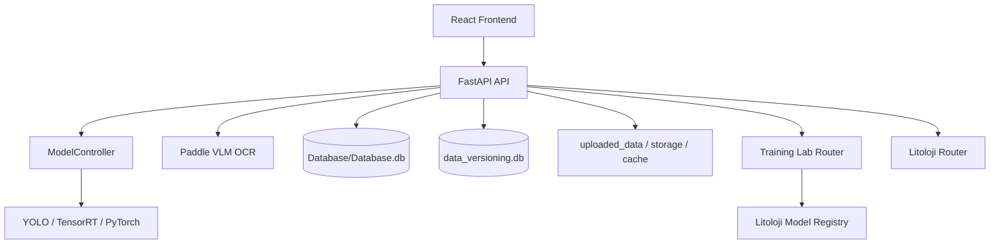

# Sistem Mimarisi

INOVAKO ESAN, karot goruntulerini isleyen bir masaustu/web hibrit gelistirme yapisina sahiptir. Frontend Vite ile, backend FastAPI ile calisir. Agir islem katmani YOLO, OCR, OpenCV, PyTorch ve litoloji modellerinden olusur.

## Katmanlar

## Ana sorumluluklar

| Katman | Sorumluluk |
| --- | --- |
| React | Kullanici akislari, gorsel dogrulama, model secimleri, training lab ve data platform UI |
| FastAPI | HTTP API, model is kuyrugu, dosya okuma/yazma, veritabani islemleri |
| ModelController | Ana model, takoz modeli, satir modeli ve siniflandirma modeli yonetimi |
| Model worker'lar | YOLO ve OCR gibi maliyetli isleri ana request akisindan ayirma |
| SQLite | Detection, maneuver, ayar, data platform ve lineage verisi |
| Filesystem | Goruntuler, model dosyalari, cache, export ve metadata |

## Ana veri akisi

1. Kullanici frontend uzerinden kuyu goruntulerini yukler.
2. Backend goruntuleri `uploaded_data` altinda saklar.
3. YOLO tabanli modeller satir, takoz ve karot siniflarini cikarir.
4. Validate sayfasi tespitleri duzenlenebilir hale getirir.
5. Mineral ve litoloji akislari dogrulanmis detection verisini kullanir.
6. Export sayfasi final manevra ve gorsel ciktilari uretir.

## Kritik tasarim kararlari

| Karar | Gerekce |
| --- | --- |
| FastAPI router'lari domain bazli ayrildi | Litoloji, training lab, data platform ve settings birbirinden bagimsiz gelistirilebilir |
| Model worker kuyruklari kullaniliyor | Uzun suren inference islemleri request akisini kilitlemesin |
| Dosya sistemi ana storage olarak kaliyor | Goruntu ve model dosyalari buyuk; SQLite yalnizca metadata icin uygun |
| Data platform snapshot yapisi var | Model egitiminde kullanilan veri setleri izlenebilir olmali |
