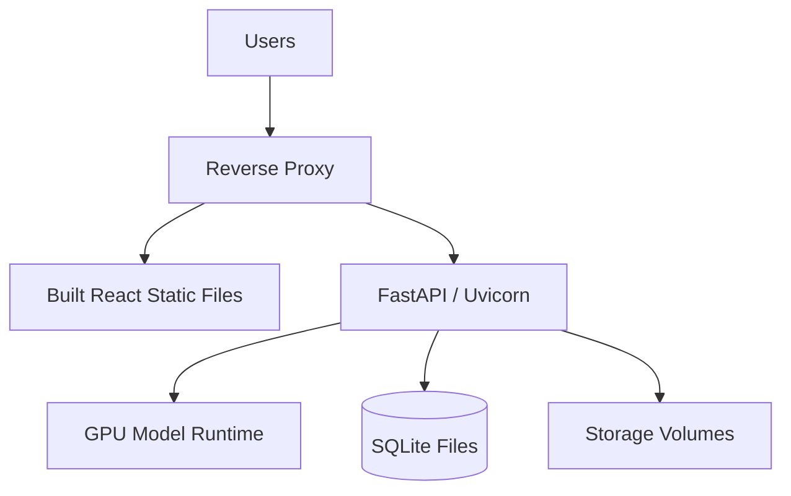

# Deployment Guide

Bu proje gelistirme ortaminda iki servisle calisir: FastAPI backend ve Vite frontend. Dokumantasyon Mintlify uzerinden ayrica deploy edilir.

## Local development deployment

Backend:

```powershell
cd ESANLAST-main
python run_backend.py
```

Frontend:

```powershell
cd ESANLAST-main\React
npm install
npm run dev
```

Dokumantasyon:

```powershell
cd ESANLAST-main\documentation
mint dev
```

## Full app launcher

`main.py`, Vite frontend'i baslatir ve sonra FastAPI backend'i calistirir.

```powershell
cd ESANLAST-main
python main.py
```

Bu yontem demo icin pratik, hata ayiklama icin servisleri ayri terminalde acmak daha sagliklidir.

## Production aday mimari



## Frontend build

```powershell
cd ESANLAST-main\React
npm run build
```

Build ciktisi Vite config'e gore `dist/` altina uretilir. Production'da statik dosyalar reverse proxy veya static server ile servis edilebilir.

## Backend service olarak calistirma

Backend icin minimum ortam:

| Gereksinim | Not |
| --- | --- |
| Python environment | PyTorch, FastAPI, OpenCV, ultralytics, OCR bagimliliklari |
| GPU driver | CUDA uyumlu PyTorch gerekiyorsa |
| Model dosyalari | `Model/Model Files` altinda beklenen dosyalar |
| Writable storage | `uploaded_data`, `Database`, `data_versioning`, `storage`, `exports` |

## Environment variables

| Degisken | Varsayilan | Amac |
| --- | --- | --- |
| `PYTORCH_CUDA_ALLOC_CONF` | `expandable_segments:True` | GPU memory fragmentation azaltma |
| `PREFER_TRT` | `1` | `.engine` model dosyalarini tercih etme |

## Deployment checklist

| Kontrol | Basarili kriter |
| --- | --- |
| Backend startup | ModelController hata vermeden yuklenir |
| GPU kontrolu | Startup logunda beklenen GPU gorulur |
| Frontend API base | `http://host:8000` veya production API adresi dogru |
| Writable dirs | DB, upload, cache ve export klasorlerine yazilabilir |
| Sample inference | Kucuk bir kuyu klasoruyle process tamamlanir |
| Export | Dosya uretimi ve download calisir |

## Rollback

1. Son calisan model dosyalarini silmeden saklayin.
2. DB dosyalarini release oncesi yedekleyin.
3. Frontend build artifact'ini versiyonlu tutun.
4. Dokumantasyon GitHub commit hash'ini release notuna yazin.