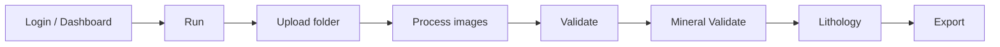

# Operator Guide

Bu sayfa uygulamayi kod degistirmeden kullanan operator veya teknik kullanici icindir.

## Gunluk akis

## 1. Veri yukleme

| Adim | Ekran | Beklenen sonuc |
| --- | --- | --- |
| Kuyu klasoru sec | Run | Goruntu listesi yuklenir |
| Model sec | Run / Settings | Ana model, takoz modeli ve gerekiyorsa siniflandirma modeli secilir |
| Analiz baslat | Run | Progress bar ilerler |

## 2. Validate

Validate ekrani tespit kutularini kontrol etmek icindir.

| Islem | Sonuc |
| --- | --- |
| Kutu ekle | `Changes` tablosuna yeni detection eklenir |
| Kutu sil | Detection kaydi session bazli kaldirilir |
| Sinif degistir | Ilgili detection `class_name` guncellenir |
| Toplu kaydet | Backend `save_bulk_changes` endpoint'ine yazilir |

## 3. Mineral ve litoloji

Mineral Validate ve Lithology ekranlari dogrulanmis detection verisine baglidir. Litoloji ekrani acilmadan once geoteknik detection verisi uretildiginden emin olun.

| Hata | Muhtemel neden |
| --- | --- |
| Litoloji verisi gelmiyor | Once geoteknik analiz/validate yapilmamis |
| Model listesi bos | Training Lab model klasoru bos |
| Goruntu yuklenmiyor | `uploaded_data/{hole_id}` klasoru yok veya dosya yolu bozuk |

## 4. Export

Export, manevra ve analiz sonuclarini dosyaya cikarmak icindir. Export oncesi:

1. Validate kayitlari tamamlanmis olmali.
2. Mineral/litoloji manevralari kontrol edilmeli.
3. Kuyu ve session bilgisi dogru olmali.

## Operator smoke test

Yeni kurulumdan sonra su test uygulanir:

| Kontrol | Basarili kriter |
| --- | --- |
| Frontend acilir | Dashboard gorulur |
| Backend saglikli | `/dashboard/stats` hata donmez |
| Klasor yukleme | Run ekraninda goruntu listesi olusur |
| Analiz | Progress tamamlanir |
| Validate | Islenmis frame gorulur |
| Export | Dosya indirilebilir |