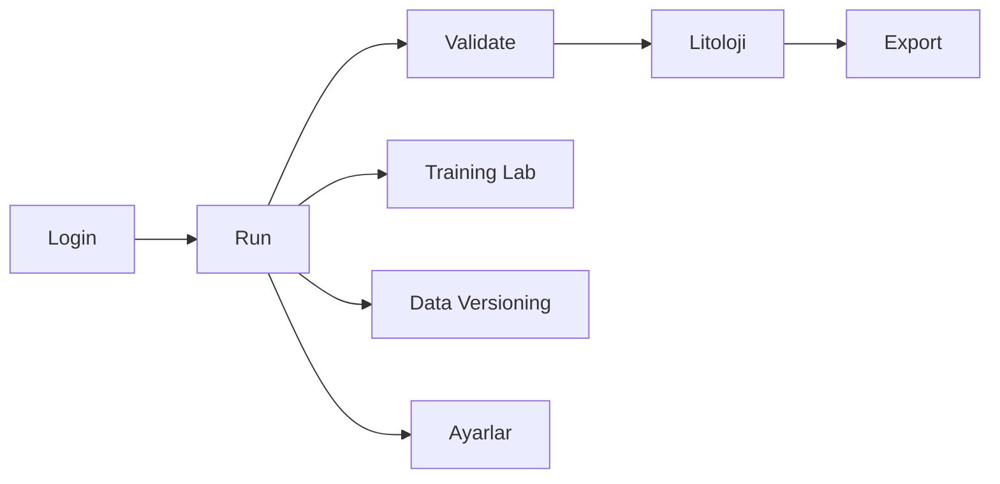

# User Walkthrough

Bu sayfa, son kullanicinin platform icinde izledigi ana akisi ekran sirasina gore anlatir. Amac; yeni ekip uyelerinin hangi ekranda ne yapildigini hizli kavramasi ve testlerde ayni sirayi takip edebilmesidir.

## Ekran sirasi

## Login

Kullanici sisteme giris yapar. Backend tarafinda kullanici ve rol bilgisi dogrulanir, frontend tarafinda oturum state'i olusturulur.

| Kontrol | Beklenen sonuc |
| --- | --- |
| Kullanici girisi | Oturum bilgisi olusur |
| Rol bilgisi | Menu ve yetkiler role gore acilir |
| Hata durumu | Kullaniciya giris hatasi gosterilir |

## Run

Run ekraninda kuyu goruntuleri ve model calistirma akisi yonetilir. Kullanici gorselleri yukler, model/parametre secimi yapar ve isleme surecini baslatir.

| Adim | Aciklama |
| --- | --- |
| Klasor yukleme | Kuyu goruntuleri backend'e gonderilir |
| Model secimi | Ana model, takoz modeli ve ilgili ayarlar secilir |
| Process baslatma | YOLO/OCR worker'lari calisir |
| Sonuc izleme | Islem durumu ve cikan sonuclar takip edilir |

## Validate

Validate ekrani detection kutularini kontrol etmek, eklemek, silmek ve tablo verisini duzeltmek icindir.

| Islem | Backend etkisi |
| --- | --- |
| Kutu ekleme | Yeni detection degisikligi kaydedilir |
| Kutu silme | Ilgili detection sonucu kaldirilir |
| Tablo degistirme | Tablo state'i guncellenir |
| Toplu kaydetme | Session degisiklikleri kalici hale getirilir |

## Litoloji

Litoloji akisi, onceki detection verilerinden hareketle litolojik siniflandirma ve manevra uretimi icin kullanilir.

1. Model secilir.
2. Session verisi litoloji editorune yuklenir.
3. Bolgeler ve litoloji siniflari duzenlenir.
4. Final manevra ciktisi olusturulur.

## Export

Export ekrani Validate, Mineral Validate ve Litoloji adimlarindan gelen sonuclari rapor formatina donusturur.

| Cikti | Kontrol |
| --- | --- |
| Siniflandirma | Kuyu ve derinlik bilgisi dogru mu |
| Manevra tablosu | Baslangic/bitis araliklari tutarli mi |
| Renk degisimleri | Litoloji renkleri beklenen standarda uygun mu |

## Training Lab

Training Lab; dataset inceleme, veri temizleme, egitim ve test akislari icin kullanilir.

## Data Versioning

Data Versioning ekraninda dataset ve model ciktilari versiyon bazli izlenir.

## Ayarlar ve kullanici yonetimi

Operasyon ve yetki yonetimi icin ayarlar, kullanici yonetim paneli ve hata izleme ekranlari kullanilir.

## Screenshot standardi

- PNG format kullanin.
- Hassas kuyu, kullanici veya musteri bilgilerini gerekiyorsa maskeleyin.
- Dosyalari `assets/screens/` altina koyun.
- Dosya adlarinda Turkce karakter ve bosluk kullanmayin.