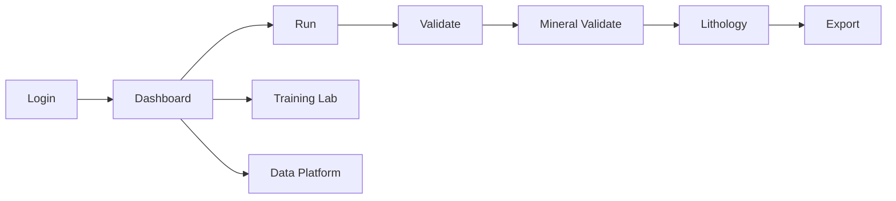

# User Walkthrough

Bu sayfa son kullanici akisini ekran sirasina gore anlatir. Uygulama tam calisir ortamda acildiginda bu sayfaya gercek ekran goruntuleri eklenmelidir.

## Ekran sirasi



## Login / Dashboard

| Kullanici aksiyonu | Beklenen sonuc |
| --- | --- |
| Kullanici adini girer | `/ldap_auth/{user}` cagrilir |
| Rol backend'den gelir | Redux session state guncellenir |
| Role gore menu acilir | Admin/supervisor/engineer yetkileri uygulanir |

Screenshot checklist:

| Dosya adi | Icerik |
| --- | --- |
| `assets/screens/login.png` | Login formu |
| `assets/screens/dashboard.png` | Dashboard ve sidebar |

## Run

| Adim | Aciklama |
| --- | --- |
| Klasor yukle | Kuyu goruntuleri backend'e gonderilir |
| Model sec | Ana model, takoz modeli ve diger inference ayarlari secilir |
| Process baslat | YOLO/OCR worker'lari calisir |
| Progress izle | `/progress/` endpoint'i ile durum takip edilir |

Screenshot checklist:

| Dosya adi | Icerik |
| --- | --- |
| `assets/screens/run-upload.png` | Klasor yukleme paneli |
| `assets/screens/run-progress.png` | Progress state |

## Validate

Validate ekrani detection kutularini duzeltmek icindir.

| Islem | Backend etkisi |
| --- | --- |
| Kutu ekleme | `/add_box_to_changes/{session_id}` |
| Kutu silme | `/delete_box/` |
| Tablo degistirme | `/table_changed` |
| Toplu kaydetme | `/save_bulk_changes/{session_id}` |

## Lithology

Litoloji ekrani onceki detection verisine baglidir.

1. Model secilir.
2. `/litho/load-session` ile editor paketi alinir.
3. Bolgeler UI'da duzenlenir.
4. `/litho/build-maneuvers` ile final manevralar uretilir.

## Export

Export oncesi Validate, Mineral Validate ve Lithology akislari kontrol edilmelidir. Kullanici export dosyasini indirdikten sonra dosya adi ve kuyu id dogrulanmalidir.

## Screenshot ekleme standardi

- PNG format kullanin.
- Hassas kuyu/veri isimlerini maskeleyin.
- Dosyalari dokumantasyon reposunda `assets/screens/` altina koyun.
- MDX icinde relative path ile gosterin.

Ornek:

```mdx

```