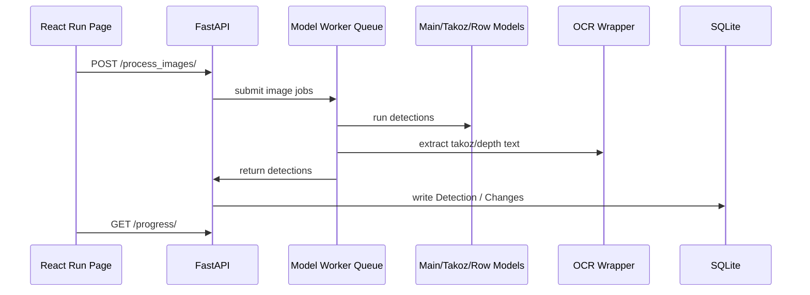
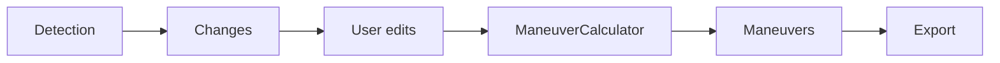
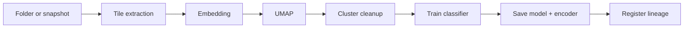

# Model Pipeline

## Jeoteknik inference



## Validate to maneuver



## Lithology pipeline

```mermaid
flowchart TB
    A[Changes / session detections] --> B[/litho/load-session]
    B --> C[Resolve uploaded_data hole folder]
    C --> D[Row/Takoz/Core model context]
    D --> E[classify_images_to_litho]
    E --> F[Editor regions]
    F --> G[User edits]
    G --> H[/litho/build-maneuvers]
    H --> I[Lithology maneuver table]
```

## Training Lab pipeline



## Performance considerations

| Alan | Not |
| --- | --- |
| GPU warmup | `Api/api.py` startup dummy inference yapar |
| Worker queue | YOLO, takoz ve line modelleri ayri queue worker ile calisir |
| Image encoding | Base64 yerine `/frame/{session_id}` binary JPEG tercih edilir |
| SQLite writes | Bulk yazimlar tek tek insert'ten daha verimlidir |
| TensorRT | Uyumlu GPU'da hiz saglar, tasinabilirlik riski vardir |