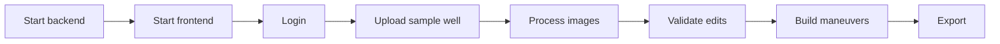

# Test Strategy

Frontend tarafinda Playwright testleri `React/tests` altindadir. Backend tarafinda domain bazli manuel/smoke testler onemlidir cunku model dosyalari ve GPU runtime ortama baglidir.

## Playwright testleri

| Test dosyasi | Kapsam |
| --- | --- |
| `login.spec.js` | Login ve LDAP hata senaryolari |
| `run.spec.js` | Run sayfasi temel akislari |
| `validate.spec.js` | Validate sayfasi UI ve tablo akislari |
| `mineralValidate.spec.js` | Mineral Validate akislari (legacy ekran) |
| `export.spec.js` | Export sayfasi |
| `settings.spec.js` | Settings sayfasi |
| `admin_developer.spec.js` | Admin/developer sayfalari |
| `edge_cases.spec.js` | Edge-case UI testleri |
| `real_well.spec.js`, `realWell.spec.js` | Gercek kuyu senaryolari |

## Calistirma

```powershell
cd ESANLAST-main\React
npm install
npx playwright test
```

HTML rapor:

```powershell
npx playwright show-report
```

## Playwright config

Kaynak:

```text
React/playwright.config.js
```

| Ayar | Deger |
| --- | --- |
| `testDir` | `./tests` |
| `baseURL` | `http://localhost:5173` |
| `workers` | `1` |
| `timeout` | `60000` |
| `screenshot` | `only-on-failure` |
| `trace` | `on-first-retry` |
| `webServer` | `npm run dev` |

## Backend smoke test

| Test | Beklenen sonuc |
| --- | --- |
| Backend start | `uvicorn` 8000 portunda calisir |
| Model load | Startup logunda model cache pre-load gorulur |
| `/dashboard/stats` | 200 response |
| `/checkMainModelNames` | Model listesi doner |
| `/litho/models` | Litoloji model listesi veya bos liste doner |
| `/data/datasets` | Data Platform dataset listesi doner |

## End-to-end manuel smoke



## Release gate

Release oncesi minimum:

| Gate | Zorunlu mu |
| --- | --- |
| `mint broken-links` | Evet |
| Frontend build | Evet |
| Backend startup | Evet |
| Model smoke inference | Model degistiyse evet |
| Playwright critical tests | UI degistiyse evet |