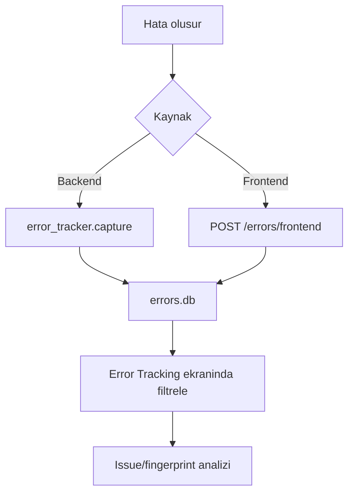

Error Tracking ekrani developer rolundeki kullanicilar icin operasyonel hata takibi
saglar. Backend exception'lari ve frontend tarafindan bildirilen hatalar
`errors.db` icinde tutulur.

<Info>
  Bu ekrana `developer` yetkisi olan kullanicilar erisebilir (`/error-tracking`).
  Backend tarafinda developer kontrolu `Api/dev_error_mixin.py` icindeki
  `_check_developer` davranisina baglidir.
</Info>

<Frame caption="Error Tracking ekrani">
  
</Frame>

## Veri kaynagi

| Kaynak | Dosya / endpoint |
| --- | --- |
| Error DB | `errors.db` |
| Backend capture | `log/error_tracker.py` |
| Frontend capture | `POST /errors/frontend` |
| Developer API | `/dev/errors`, `/dev/issues`, `/dev/session-stats` |

## Ekran akisi

## Endpointler

| Endpoint | Amac |
| --- | --- |
| `GET /dev/errors` | Hatalari source, level, fingerprint, since ve search filtreleriyle listeler. |
| `GET /dev/errors/{error_id}` | Tekil hata detayini getirir. |
| `DELETE /dev/errors` | Hata listesini temizler. |
| `GET /dev/issues` | Fingerprint bazli gruplanmis issue listesini verir. |
| `PATCH /dev/errors/{error_id}/status` | Hata durumunu gunceller. |
| `GET /dev/session-stats` | Son 30 gun icin session/hata istatistiklerini getirir. |

## Inceleme standardi

<Steps>
  <Step title="Issue gorunumunu kontrol et">
    Once `Issues` gorunumunde tekrarlayan fingerprint'leri kontrol edin.
  </Step>
  <Step title="Tekil hatayi incele">
    Error detayinda endpoint, stack trace, username ve session id alanlarini inceleyin.
  </Step>
  <Step title="Kaynaga in">
    Backend hatasinda ilgili FastAPI endpointini, frontend hatasinda route ve component bilgisini bulun.
  </Step>
  <Step title="Durumu guncelle">
    Cozulduyse status guncelleyin veya listeyi release sonrasi temizleyin.
  </Step>
</Steps>

## Saklama politikasi

<Note>
  `log/error_tracker.py` eski hatalari otomatik temizleyebilir. Varsayilan
  davranista 30 gunden eski hatalar silinir. Kritik hatalar release notuna veya
  issue tracker'a tasinmalidir.
</Note>
