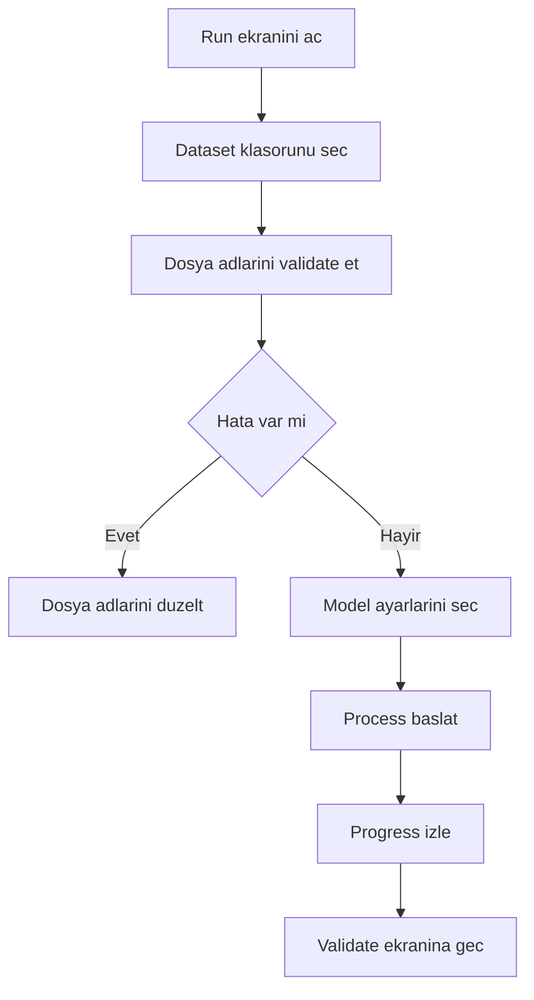

# Run Guide

Run ekrani, ham karot goruntulerinin sisteme alindigi ve ana analiz isinin baslatildigi ilk operasyon ekranidir. Bu ekran tamamlanmadan Validate, Mineral Validate, Export ve Lithology akislari saglikli calismaz.

## Kullanici amaci

| Amac | Aciklama |
| --- | --- |
| Dataset yuklemek | Kuyu klasorundeki goruntuler backend'e tanitilir. |
| Dosya adlarini dogrulamak | Klasor ve dosya isimleri kuyu/derinlik standardina gore kontrol edilir. |
| Model secmek | Ana YOLO modeli, takoz modeli ve siniflandirma modeli secilir. |
| Analizi baslatmak | Backend worker'lari goruntu, OCR, row ve detection adimlarini calistirir. |
| Progress izlemek | Isleme durumu `/progress/` uzerinden takip edilir. |

## On kosullar

- Backend calisir durumda olmali.
- Frontend `BASE_URL` dogru backend adresini gostermeli.
- Model dosyalari `Model/Model Files` altinda bulunmali.
- Klasor/dosya adlari beklenen kuyu standardina uymali.
- Kullanici `run` yetkisine sahip olmali.

## Ekran akisi

## Model secimi

Run ekrani model listelerini backend'den alir.

| Liste | Endpoint | Not |
| --- | --- | --- |
| Ana model | `GET /checkMainModelNames` | Segmentasyon/detection modeli. |
| Takoz modeli | `GET /checkTakozModelNames` | Spacer/takoz tespiti icin kullanilir. |
| Classification modeli | `GET /checkClsModelNames` | Siniflandirma destek modeli. |

Settings ekraninda secilen varsayilan modeller Run ekranina otomatik yansiyabilir. Operasyon oncesi model adinin dogru oldugunu kontrol edin.

## Dosya dogrulama

| Kontrol | Endpoint | Basarisiz olursa |
| --- | --- | --- |
| Klasor/dosya standardi | `GET /validate_filenames/?folder_name=...` | Klasor islenmeden once kullaniciya hata gosterilir. |
| Goruntu listesi | `GET /get_images/{folder_name}` | Goruntu listesi bos ise isleme baslatilmamalidir. |
| Statik goruntu erisimi | `/static/uploaded_data/...` | Thumbnail/preview yuklenemezse path kontrol edilir. |

## Basarili calisma kriterleri

- Progress degeri ilerler ve backend hata donmez.
- Session id olusur.
- Validate ekranina gecilebilir.
- `get_maneuvers` ve frame endpointleri sonraki ekranda veri dondurur.

## Sik hatalar

| Belirti | Muhtemel neden | Cozum |
| --- | --- | --- |
| Dosya adi validasyon hatasi | Klasor adi ile goruntu prefix'i uyumsuz | Dosya adlarini kuyu standardina gore duzeltin. |
| Model listesi bos | Model klasorleri eksik veya backend model scan edemiyor | `Model/Model Files` ve Settings model adlarini kontrol edin. |
| Progress ilerlemiyor | Backend worker takildi veya GPU/CPU problemi var | Backend loglarini ve Error Tracking ekranini kontrol edin. |
| Validate aciliyor ama veri yok | Session kaydi tamamlanmamis | Run islemini tekrar deneyin, backend response'unu kontrol edin. |

## Screenshot beklenenleri

- Klasor secimi ve dosya validasyonu.
- Model secim alani.
- Progress state.
- Basarili run sonrasi Validate'e gecis.
