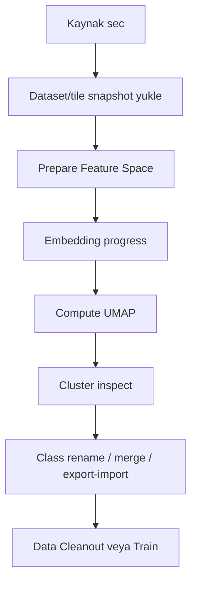

# Training Lab User Guide

Training Lab, litoloji siniflandirma modelleri icin veri hazirlama, embedding cikarma, kumeleme, etiket temizleme, model egitme ve test etme ekranidir.

## Tab yapisi

| Tab | Amac |
| --- | --- |
| Explorer | Folder/snapshot/tile kaynagindan feature space hazirlar, UMAP ve cluster gorunumu sunar. |
| Data Cleanout | Tile/samples uzerinde temizleme ve kaydetme islemlerini yapar. |
| Classes | Sinif isimleri ve etiket paketleri uzerinde calisir. |
| Train | Temizlenmis veriyle modeli egitir ve registry'ye kaydeder. |
| Test | Kaydedilen modeli tekil ornek veya strip uzerinde test eder. |

## Explorer kaynak modlari

| Mode | Ne zaman kullanilir |
| --- | --- |
| Folder | Lokal klasorden hizli analiz yapmak icin. |
| Composition | Data Platform composition uzerinden egitim hazirlamak icin. |
| Tiles | Daha once uretilmis tile snapshot'i tekrar yuklemek icin. |

## Explorer akisi

## Kritik endpointler

| Endpoint | Amac |
| --- | --- |
| `POST /traininglab/dataset-info` | Klasor icindeki goruntu sayisini ve durumunu okur. |
| `POST /traininglab/compute-embeddings` | Tile extraction ve embedding surecini baslatir. |
| `GET /traininglab/embedding-progress` | Arka plan islemini izler. |
| `POST /traininglab/compute-umap` | UMAP koordinatlari ve clusterlari hesaplar. |
| `POST /traininglab/recluster` | Kume sayisini degistirir. |
| `POST /traininglab/update-cluster-names` | Cluster/sinif adlarini kaydeder. |
| `POST /traininglab/export-class-package` | Bir sinifin etiket paketini ZIP olarak indirir. |
| `POST /traininglab/import-class-package` | Etiket paketini baska cluster'a uygular. |
| `POST /traininglab/finalize-assignments` | Son etiket atamalarini kalici hale getirir. |
| `GET /traininglab/train-stream` | Model egitim loglarini stream eder. |
| `POST /traininglab/test-sample` | Model test islemini yapar. |

## Kullanici kontrol listesi

1. Kaynak modunu dogru secin.
2. Tile extraction parametrelerini degistirdiyseniz eski snapshot ile karistirmayin.
3. UMAP cluster isimlerini kaydetmeden Train'e gecmeyin.
4. Exclude edilen ornekleri Train oncesi tekrar kontrol edin.
5. Model kaydindan sonra Data Platform lineage kaydinin olustugunu kontrol edin.

## Sik hatalar

| Belirti | Muhtemel neden | Cozum |
| --- | --- | --- |
| UMAP bos | Embedding tamamlanmadi veya cache yok | Progress bitene kadar bekleyin, sonra Compute Plot. |
| Tile snapshot yuklenmiyor | Snapshot READY degil veya composition baglantisi yok | Data Platform'da snapshot durumunu kontrol edin. |
| Train modeli kaydetmiyor | Sinifler finalize edilmemis | Data Cleanout/Classes adimlarini tamamlayin. |
| Test sonucu beklenenden farkli | Yanlis model veya yanlis trim/window parametresi | Registry metadata ve Settings degerlerini kontrol edin. |

## Screenshot beklenenleri

- Explorer source mode secimi.
- UMAP cluster gorunumu.
- Data Cleanout ornek temizleme.
- Train loglari.
- Test sonucu.
