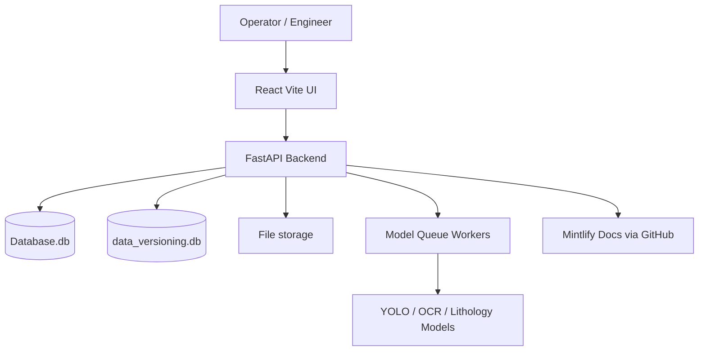
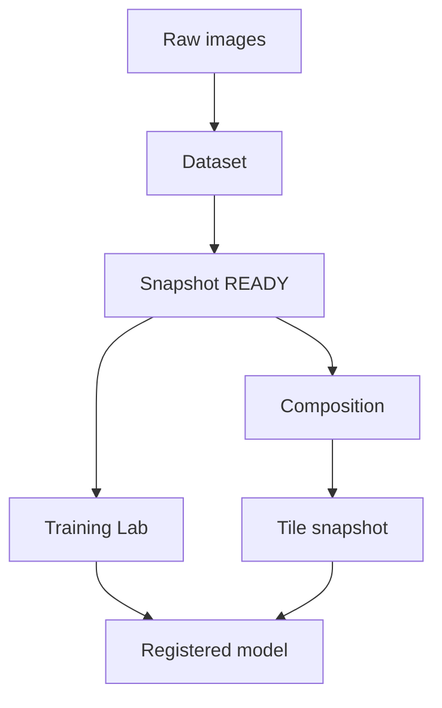
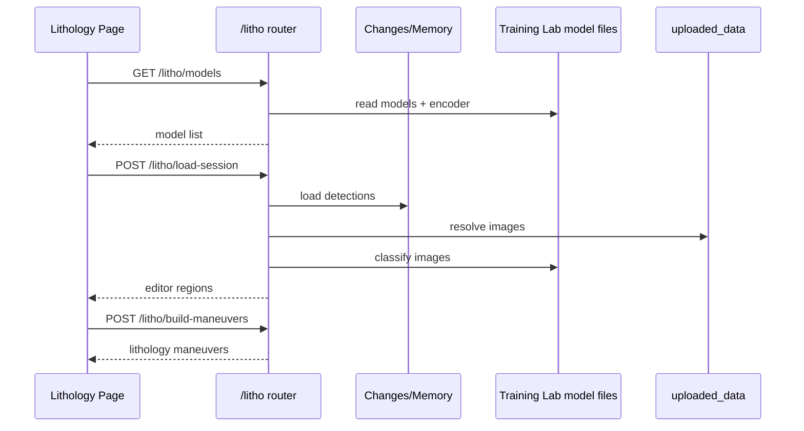
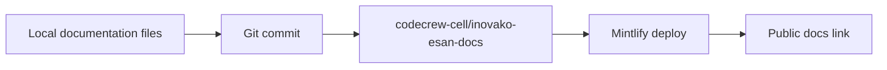

# Architecture Diagrams

## Full system context



## Backend router map

```mermaid
flowchart LR
    API[Api/api.py] --> Legacy[Legacy analysis endpoints]
    API --> Data[/data router]
    API --> Litho[/litho router]
    API --> Training[/traininglab router]
    API --> Settings[/settings router]
    API --> Users[/users router]
    API --> Dev[/dev diagnostics]
```

## Data lineage



## Lithology sequence



## Documentation publishing

