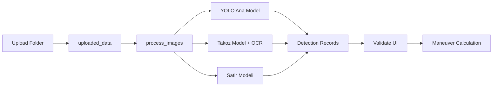

# Jeoteknik Analiz Akisi

Jeoteknik analiz akisi, kuyu goruntulerinden karot parcalari, satir yapisi, takoz bilgisi ve OCR destekli derinlik verisi uretir.

## Ozet akis

## Ilgili endpoint'ler

| Method | Path | Amac |
| --- | --- | --- |
| `POST` | `/upload_folder/` | Kuyu klasoru yukleme |
| `GET` | `/get_images/{folder_name}` | Klasordeki goruntuleri listeleme |
| `POST` | `/process_images/` | Secili goruntulerde analiz baslatma |
| `POST` | `/process_uploaded_folder/` | Yuklenmis klasor uzerinden analiz |
| `POST` | `/reanalyze_image/` | Tek goruntuyu tekrar analiz etme |
| `GET` | `/progress/` | Isleme durumunu okuma |
| `GET` | `/frame/{session_id}` | Islenmis JPEG ciktisini alma |

## Validate adimi

Validate ekrani detection kayitlarini kullaniciya duzenlenebilir olarak sunar. Duzenlemeler su endpoint'lerle backend'e yazilir:

| Method | Path | Amac |
| --- | --- | --- |
| `POST` | `/add_box_to_changes/{session_id}` | Detection ekleme |
| `POST` | `/table_changed` | Detection tablosu degisikliklerini yazma |
| `DELETE` | `/delete_box/` | Detection silme |
| `POST` | `/save_bulk_changes/{session_id}` | Toplu degisiklik kaydetme |
| `GET` | `/maneuvers_from_changes/{session_id}` | Degisikliklerden manevra hesaplama |
| `GET` | `/get_maneuvers/{session_id}` | Hesaplanan manevralari getirme |

## Bagimli modeller

| Model turu | Gorev |
| --- | --- |
| Ana YOLO modeli | Karot / mineral / geoteknik nesne tespiti |
| Takoz modeli | Takoz alanlarinin tespiti |
| Satir modeli | Karot kutusu satir geometrisi |
| OCR | Takoz ve derinlik bilgisinden metin cikarimi |
