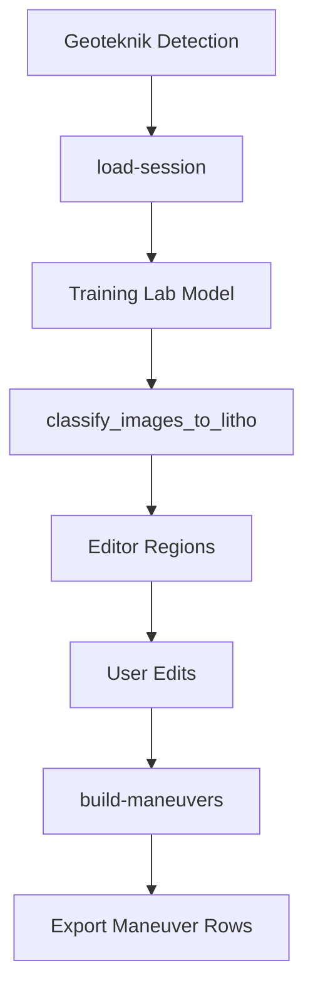

# Litoloji Analizi

Litoloji akisi `karot_analiz/litho_api.py` icinde FastAPI router olarak sunulur. Ayri bir servis yerine ana backend uygulamasina `include_router` ile baglanir.

## Router

```python
router = APIRouter(prefix="/litho", tags=["litho"])
```

## Temel prensip

Litoloji analizi, geoteknik detection verisini kaynak kabul eder. Editor bolgeleri, goruntuler ve model tahminleri birlikte kullanilarak litolojik manevra listesi uretilir.



## Model kaynagi

Litoloji model listesi Training Lab'in kalici model klasorunden okunur:

```text
LithologyAnalysis/karot_inference_pack/models
```

`__temp__` ile baslayan gecici modeller listeye dahil edilmez.

## Onemli yardimcilar

| Fonksiyon | Sorumluluk |
| --- | --- |
| `_changes_map_from_memory` | Taze session detection verisini bellekte arar |
| `_encoder_classes` | Model label encoder siniflarini editor secenegine cevirir |
| `_classify_and_pack` | Goruntuleri litoloji modeline sokar ve editor paketini uretir |
| `_build_litho_maneuvers_from_editor` | Editor bolgelerinden derinlik bazli manevra satirlari uretir |
| `_resolve_litho_image_path` | Editor tarafindan istenen goruntu yolunu guvenli sekilde cozer |

## Cikti

Litoloji manevra ciktisi, export tarafinda kullanilabilecek su alanlari icerir:

| Alan | Anlam |
| --- | --- |
| `mineralBlockStart` | Baslangic derinligi |
| `mineralBlockEnd` | Bitis derinligi |
| `colorChangeClass` | Ana litoloji sinifi |
| `secondaryColorChangeClass` | Ikinci alternatif sinif |
| `thirdColorChangeClass` | Ucuncu alternatif sinif |
| `color1rgb`, `color2rgb`, `color3rgb` | Segment renk ozetleri |
| `visualSegments` | Gorsel kaynak ve editor koordinatlari |
