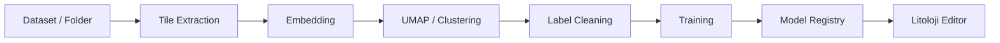

# Training Lab

Training Lab API'si `LithologyAnalysis/training_lab_api.py` icinde `/traininglab` prefix'i ile sunulur. Agir islemler `extraction.py`, `inference.py`, `training.py` ve ilgili cache/store modullerine dagitilmistir.

## Ana is akisi

## Cache alanlari

| Yol | Amac |
| --- | --- |
| `LithologyAnalysis/training_lab_cache/sessions` | Training Lab oturumlari |
| `LithologyAnalysis/training_lab_cache/features` | Embedding, registry ve egitim gecmisi |
| `LithologyAnalysis/training_lab_cache/tiles` | Uretilen tile goruntuleri |
| `LithologyAnalysis/training_lab_cache/row_crops` | Satir crop verileri |
| `LithologyAnalysis/training_lab_cache/strips` | Serit ornekleri |
| `LithologyAnalysis/karot_inference_pack/models` | Kalici litoloji modelleri |

## One cikan endpoint gruplari

| Grup | Endpoint ornekleri |
| --- | --- |
| Dataset hazirlama | `POST /traininglab/dataset-info`, `POST /traininglab/upload-folder` |
| Embedding | `POST /traininglab/compute-embeddings`, `GET /traininglab/embedding-progress` |
| Kumeleme | `POST /traininglab/compute-umap`, `POST /traininglab/recluster` |
| Etiket yonetimi | `POST /traininglab/update-labels`, `POST /traininglab/rename-class`, `POST /traininglab/exclude-samples` |
| Model yonetimi | `GET /traininglab/models`, `POST /traininglab/save-model`, `POST /traininglab/delete-model` |
| Test | `POST /traininglab/upload-test-image`, `POST /traininglab/test-sample` |
| Egitim stream | `GET /traininglab/train-stream` |

## Model registry

Model metadata'si `model_registry.json` icinde tutulur. Litoloji editor, modelin egitimde kullandigi trim orani gibi bilgileri bu registry uzerinden okumaya calisir.

## Data Platform entegrasyonu

Training Lab, Data Platform snapshot'lariyla birlikte calisabilir. Egitim tamamlandiktan sonra model lineage kaydi `/data/models/register` endpoint'iyle Data Platform'a yazilir.
