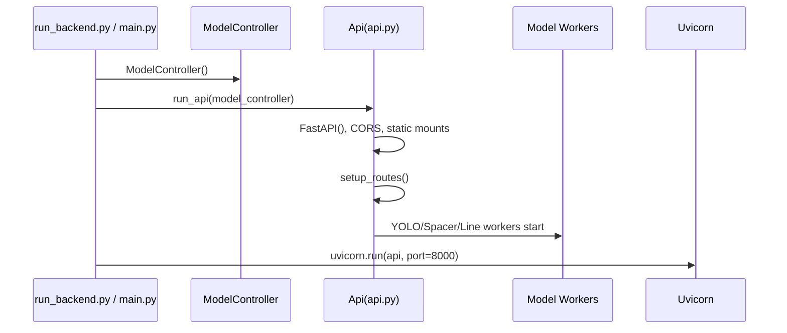

# Backend Runtime

The backend runtime is started via `run_backend.py` or `main.py`.

## Startup sequence

## Main files

| File | Role |
| --- | --- |
| `run_backend.py` | Backend-only entry point |
| `main.py` | Runs the Vite frontend and backend together |
| `Api/api.py` | FastAPI instance, CORS, route registration, worker setup |
| `Api/model_queue_worker.py` | Queue-based model worker |
| `Api/model_worker.py` | Model worker pool |
| `Model/model_controller.py` | Manages model files and default model jobs |

## Included routers

| Router | Prefix | File |
| --- | --- | --- |
| Training Lab | `/traininglab` | `LithologyAnalysis/training_lab_api.py` |
| Lithology Editor | `/litho` | `karot_analiz/litho_api.py` |
| Data Platform | `/data` | `Api/data_service/router.py` |
| Settings | `/settings` | `Api/settings_service/router.py` |
| User Management | `/users` | `Api/user_management_router.py` |

## Static file services

There are two important mounts in `Api/api.py`:

| Mount | Purpose |
| --- | --- |
| `/ManueverBlocks` | Serves the generated maneuver block images |
| `/static` | Provides static access to files under the project root |

## Things to watch out for

Backend startup is costly. Because of the model files and GPU preparation, the
first launch can take a long time. If TensorRT `.engine` files exist, some flows
prefer them over the `.pt` files.
