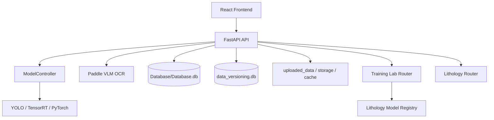

# System Architecture

INOVAKO ESAN has a desktop/web hybrid development structure that processes core
(borehole) images. The frontend runs on Vite, the backend on FastAPI. The heavy
processing layer consists of YOLO, OCR, OpenCV, PyTorch and lithology models.

## Layers

## Main responsibilities

| Layer | Responsibility |
| --- | --- |
| React | User flows, visual validation, model selections, training lab and data platform UI |
| FastAPI | HTTP API, model job queue, file read/write, database operations |
| ModelController | Management of the main model, spacer model, line model and classification model |
| Model workers | Separating costly jobs such as YOLO and OCR from the main request flow |
| SQLite | Detection, maneuver, settings, data platform and lineage data |
| Filesystem | Images, model files, cache, export and metadata |

## Main data flow

1. The user uploads well images through the frontend.
2. The backend stores the images under `uploaded_data`.
3. YOLO-based models extract row, spacer and core classes.
4. The Validate page makes the detections editable.
5. The mineral and lithology flows use the validated detection data.
6. The Export page produces the final maneuver and image outputs.

## Critical design decisions

| Decision | Rationale |
| --- | --- |
| FastAPI routers split by domain | Lithology, training lab, data platform and settings can be developed independently |
| Model worker queues are used | Long-running inference jobs should not block the request flow |
| The filesystem remains the main storage | Image and model files are large; SQLite is only suitable for metadata |
| The data platform has a snapshot structure | Datasets used in model training must be traceable |
