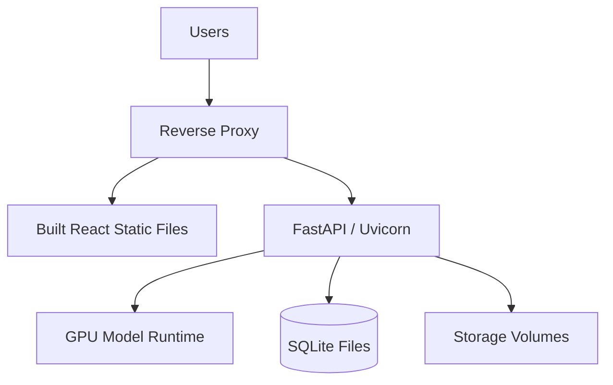

# Deployment Guide

In the development environment, this project runs with two services: the FastAPI
backend and the Vite frontend. The documentation is deployed separately via
Mintlify.

## Local development deployment

Backend:

```powershell
cd ESANLAST-main
python run_backend.py
```

Frontend:

```powershell
cd ESANLAST-main\React
npm install
npm run dev
```

Documentation:

```powershell
cd ESANLAST-main\documentation
mint dev
```

## Full app launcher

`main.py` starts the Vite frontend and then runs the FastAPI backend.

```powershell
cd ESANLAST-main
python main.py
```

This method is practical for a demo; for debugging it is healthier to open the
services in separate terminals.

## Candidate production architecture



## Frontend build

```powershell
cd ESANLAST-main\React
npm run build
```

The build output is produced under `dist/` according to the Vite config. In
production, the static files can be served with a reverse proxy or a static
server.

## Running the backend as a service

Minimum environment for the backend:

| Requirement | Note |
| --- | --- |
| Python environment | PyTorch, FastAPI, OpenCV, ultralytics, OCR dependencies |
| GPU driver | If CUDA-compatible PyTorch is needed |
| Model files | The expected files under `Model/Model Files` |
| Writable storage | `uploaded_data`, `Database`, `data_versioning`, `storage`, `exports` |

## Environment variables

| Variable | Default | Purpose |
| --- | --- | --- |
| `PYTORCH_CUDA_ALLOC_CONF` | `expandable_segments:True` | Reduce GPU memory fragmentation |
| `PREFER_TRT` | `1` | Prefer `.engine` model files |

## Deployment checklist

| Check | Success criterion |
| --- | --- |
| Backend startup | ModelController loads without error |
| GPU check | The expected GPU is seen in the startup log |
| Frontend API base | `http://host:8000` or the production API address is correct |
| Writable dirs | DB, upload, cache and export folders are writable |
| Sample inference | Processing completes with a small well folder |
| Export | File generation and download work |

## Rollback

1. Keep the last working model files without deleting them.
2. Back up the DB files before a release.
3. Keep the frontend build artifact versioned.
4. Write the documentation GitHub commit hash in the release notes.
