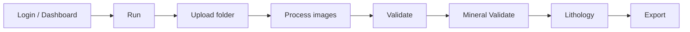

# Operator Guide

## Daily workflow

## 1. Load data

| Step | Screen | Expected result |
| --- | --- | --- |
| Select core folder | Run | Image list is loaded. |
| Select models | Run / Settings | Main model, block model, and classification model are selected. |
| Start analysis | Run | Progress bar starts and updates. |

## 2. Validate detections

The Validate screen is used to review and correct detection boxes.

| Action | Result |
| --- | --- |
| Add box | A new detection is added to the changes table. |
| Delete box | The selected detection is removed for the active session. |
| Change class | The detection `class_name` is updated. |
| Save bulk changes | Changes are persisted through the backend. |

## 3. Mineral and lithology

Mineral Validate and Lithology depend on completed geotechnical detection data. Run and validate the geotechnical workflow before opening lithology views.

## 4. Export

Before exporting:

1. Validate changes are saved.
2. Mineral and lithology maneuvers are checked.
3. Well and session information is correct.
4. Preview output is reviewed.

## Smoke test

| Check | Success criterion |
| --- | --- |
| Frontend opens | Dashboard is visible. |
| Backend is healthy | `/dashboard/stats` responds. |
| Folder upload works | Run screen lists images. |
| Analysis completes | Progress reaches completion. |
| Validate opens | Processed frame is visible. |
| Export works | Output file can be downloaded. |

