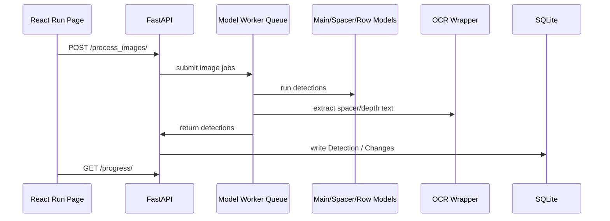
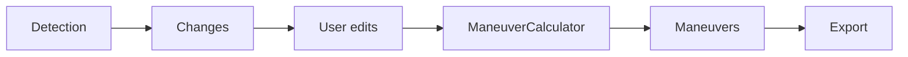
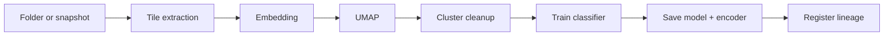

# Model Pipeline

## Geotechnical inference



## Validate to maneuver



## Lithology pipeline

```mermaid
flowchart TB
    A[Changes / session detections] --> B[/litho/load-session]
    B --> C[Resolve uploaded_data hole folder]
    C --> D[Row/Spacer/Core model context]
    D --> E[classify_images_to_litho]
    E --> F[Editor regions]
    F --> G[User edits]
    G --> H[/litho/build-maneuvers]
    H --> I[Lithology maneuver table]
```

## Training Lab pipeline



## Performance considerations

| Area | Note |
| --- | --- |
| GPU warmup | `Api/api.py` runs a startup dummy inference |
| Worker queue | YOLO, spacer and line models run with separate queue workers |
| Image encoding | Binary JPEG via `/frame/{session_id}` is preferred over Base64 |
| SQLite writes | Bulk writes are more efficient than inserting one by one |
| TensorRT | Provides speed on a compatible GPU, but carries a portability risk |
