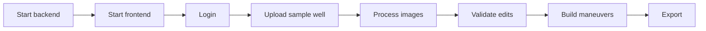

# Test Strategy

On the frontend side, the Playwright tests are under `React/tests`. On the
backend side, domain-based manual/smoke tests are important because the model
files and GPU runtime depend on the environment.

## Playwright tests

| Test file | Scope |
| --- | --- |
| `login.spec.js` | Login and LDAP error scenarios |
| `run.spec.js` | Run page basic flows |
| `validate.spec.js` | Validate page UI and table flows |
| `mineralValidate.spec.js` | Mineral Validate flows (legacy screen) |
| `export.spec.js` | Export page |
| `settings.spec.js` | Settings page |
| `admin_developer.spec.js` | Admin/developer pages |
| `edge_cases.spec.js` | Edge-case UI tests |
| `real_well.spec.js`, `realWell.spec.js` | Real well scenarios |

## Running

```powershell
cd ESANLAST-main\React
npm install
npx playwright test
```

HTML report:

```powershell
npx playwright show-report
```

## Playwright config

Source:

```text
React/playwright.config.js
```

| Setting | Value |
| --- | --- |
| `testDir` | `./tests` |
| `baseURL` | `http://localhost:5173` |
| `workers` | `1` |
| `timeout` | `60000` |
| `screenshot` | `only-on-failure` |
| `trace` | `on-first-retry` |
| `webServer` | `npm run dev` |

## Backend smoke test

| Test | Expected result |
| --- | --- |
| Backend start | `uvicorn` runs on port 8000 |
| Model load | Model cache pre-load is seen in the startup log |
| `/dashboard/stats` | 200 response |
| `/checkMainModelNames` | Returns the model list |
| `/litho/models` | Returns the lithology model list or an empty list |
| `/data/datasets` | Returns the Data Platform dataset list |

## End-to-end manual smoke



## Release gate

Minimum before a release:

| Gate | Required? |
| --- | --- |
| `mint broken-links` | Yes |
| Frontend build | Yes |
| Backend startup | Yes |
| Model smoke inference | Yes if the model changed |
| Playwright critical tests | Yes if the UI changed |
