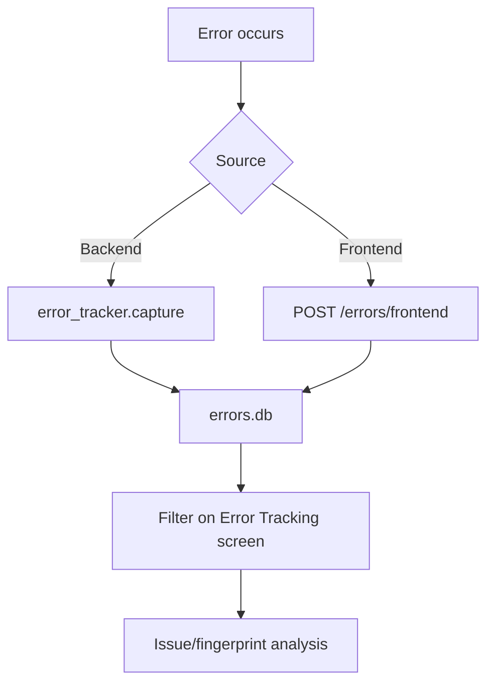

# Error Tracking Developer Guide

The Error Tracking screen provides operational error tracking for users with the
developer role. Backend exceptions and errors reported by the frontend are kept
in `errors.db`.

## Authorization

| Route | Guard |
| --- | --- |
| `/error-tracking` | User with the `developer` role |

On the backend, the developer check depends on the `_check_developer` behavior in `Api/dev_error_mixin.py`.

## Data source

| Source | File / endpoint |
| --- | --- |
| Error DB | `errors.db` |
| Backend capture | `log/error_tracker.py` |
| Frontend capture | `POST /errors/frontend` |
| Developer API | `/dev/errors`, `/dev/issues`, `/dev/session-stats` |

## Screen flow

## Endpoints

| Endpoint | Purpose |
| --- | --- |
| `GET /dev/errors` | Lists errors with source, level, fingerprint, since and search filters. |
| `GET /dev/errors/{error_id}` | Returns the detail of a single error. |
| `DELETE /dev/errors` | Clears the error list. |
| `GET /dev/issues` | Returns the issue list grouped by fingerprint. |
| `PATCH /dev/errors/{error_id}/status` | Updates the error status. |
| `GET /dev/session-stats` | Returns session/error statistics for the last 30 days. |

## Review standard

1. First check repeating fingerprints in the `Issues` view.
2. Then in a single error detail, inspect the endpoint, stack trace, username and session id fields.
3. For a backend error, find the related FastAPI endpoint.
4. For a frontend error, check the route and component info.
5. If resolved, update the status or clear the list after a release.

## Retention policy

`log/error_tracker.py` can automatically clean up old errors. By default,
errors older than 30 days are deleted. Critical errors should be moved to the
release notes or an issue tracker.

## Expected screenshots

- Error list.
- Issue/fingerprint groups.
- Error detail modal.
- Session stats area.
