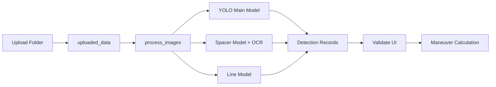

# Geotechnical Analysis Flow

The geotechnical analysis flow produces core fragments, row structure, spacer
info and OCR-supported depth data from well images.

## Summary flow

## Related endpoints

| Method | Path | Purpose |
| --- | --- | --- |
| `POST` | `/upload_folder/` | Upload a well folder |
| `GET` | `/get_images/{folder_name}` | List images in a folder |
| `POST` | `/process_images/` | Start analysis on selected images |
| `POST` | `/process_uploaded_folder/` | Analyze an uploaded folder |
| `POST` | `/reanalyze_image/` | Re-analyze a single image |
| `GET` | `/progress/` | Read the processing status |
| `GET` | `/frame/{session_id}` | Get the processed JPEG output |

## Validate step

The Validate screen presents detection records to the user as editable. Edits
are written to the backend with these endpoints:

| Method | Path | Purpose |
| --- | --- | --- |
| `POST` | `/add_box_to_changes/{session_id}` | Add a detection |
| `POST` | `/table_changed` | Write detection table changes |
| `DELETE` | `/delete_box/` | Delete a detection |
| `POST` | `/save_bulk_changes/{session_id}` | Save bulk changes |
| `GET` | `/maneuvers_from_changes/{session_id}` | Compute maneuvers from changes |
| `GET` | `/get_maneuvers/{session_id}` | Get the computed maneuvers |

## Dependent models

| Model type | Task |
| --- | --- |
| Main YOLO model | Core / mineral / geotechnical object detection |
| Spacer model | Detection of spacer areas |
| Line model | Core box row geometry |
| OCR | Text extraction from spacer and depth info |
