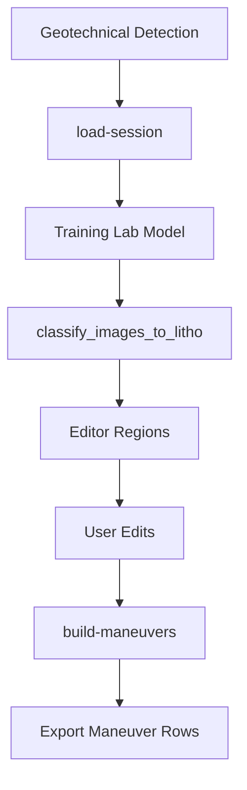

# Lithology Analysis

The lithology flow is served as a FastAPI router inside `karot_analiz/litho_api.py`.
Instead of being a separate service, it is attached to the main backend
application via `include_router`.

## Router

```python
router = APIRouter(prefix="/litho", tags=["litho"])
```

## Core principle

Lithology analysis takes geotechnical detection data as its source. Editor
regions, images and model predictions are used together to produce the
lithologic maneuver list.



## Model source

The lithology model list is read from Training Lab's persistent model folder:

```text
LithologyAnalysis/karot_inference_pack/models
```

Temporary models starting with `__temp__` are not included in the list.

## Important helpers

| Function | Responsibility |
| --- | --- |
| `_changes_map_from_memory` | Looks up fresh session detection data in memory |
| `_encoder_classes` | Converts model label encoder classes into editor options |
| `_classify_and_pack` | Runs images through the lithology model and produces the editor package |
| `_build_litho_maneuvers_from_editor` | Produces depth-based maneuver rows from editor regions |
| `_resolve_litho_image_path` | Safely resolves the image path requested by the editor |

## Output

The lithology maneuver output contains these fields usable on the export side:

| Field | Meaning |
| --- | --- |
| `mineralBlockStart` | Start depth |
| `mineralBlockEnd` | End depth |
| `colorChangeClass` | Main lithology class |
| `secondaryColorChangeClass` | Second alternative class |
| `thirdColorChangeClass` | Third alternative class |
| `color1rgb`, `color2rgb`, `color3rgb` | Segment color summaries |
| `visualSegments` | Visual source and editor coordinates |
