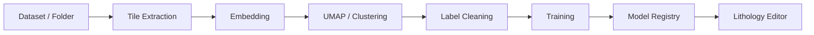

# Training Lab

The Training Lab API is served under the `/traininglab` prefix inside
`LithologyAnalysis/training_lab_api.py`. Heavy operations are distributed across
`extraction.py`, `inference.py`, `training.py` and the related cache/store modules.

## Main workflow

## Cache areas

| Path | Purpose |
| --- | --- |
| `LithologyAnalysis/training_lab_cache/sessions` | Training Lab sessions |
| `LithologyAnalysis/training_lab_cache/features` | Embedding, registry and training history |
| `LithologyAnalysis/training_lab_cache/tiles` | Generated tile images |
| `LithologyAnalysis/training_lab_cache/row_crops` | Row crop data |
| `LithologyAnalysis/training_lab_cache/strips` | Strip samples |
| `LithologyAnalysis/karot_inference_pack/models` | Persistent lithology models |

## Key endpoint groups

| Group | Endpoint examples |
| --- | --- |
| Dataset preparation | `POST /traininglab/dataset-info`, `POST /traininglab/upload-folder` |
| Embedding | `POST /traininglab/compute-embeddings`, `GET /traininglab/embedding-progress` |
| Clustering | `POST /traininglab/compute-umap`, `POST /traininglab/recluster` |
| Label management | `POST /traininglab/update-labels`, `POST /traininglab/rename-class`, `POST /traininglab/exclude-samples` |
| Model management | `GET /traininglab/models`, `POST /traininglab/save-model`, `POST /traininglab/delete-model` |
| Test | `POST /traininglab/upload-test-image`, `POST /traininglab/test-sample` |
| Training stream | `GET /traininglab/train-stream` |

## Model registry

Model metadata is kept in `model_registry.json`. The lithology editor tries to
read information such as the trim ratio used by the model during training from
this registry.

## Data Platform integration

Training Lab can work together with Data Platform snapshots. After training is
completed, the model lineage record is written to the Data Platform with the
`/data/models/register` endpoint.
