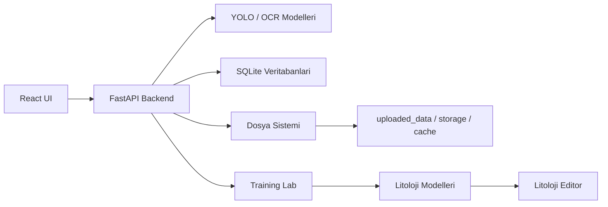

# INOVAKO ESAN Teknik Dokumantasyon

Bu dokumantasyon, `ESANLAST-main` uygulamasinin teknik calisma seklini tek yerde toplar. Hedef kitle; projeyi gelistiren, kuran, devralan veya uretim ortaminda destekleyen teknik ekiplerdir.

## Kapsam

| Alan | Icerik |
| --- | --- |
| Backend | FastAPI uygulamasi, model yukleme, router yapisi, tanilama ve kullanici yonetimi |
| Frontend | Vite + React uygulamasi, sayfa rotalari, Redux tabanli durum yonetimi |
| Goruntu analizi | Karot fotograf yukleme, YOLO tabanli tespit, validate ve export akisi |
| Litoloji | Training Lab modelleriyle litoloji segmentasyonu, editor API'si ve manevra uretimi |
| Egitim | AI Vision Lab / Training Lab veri hazirlama, embedding, kumeleme, egitim ve model kaydi |
| Veri platformu | Dataset, snapshot, composition, lineage ve metadata export akislari |

## Ana calisma akisi



## Hizli baslangic

```powershell
cd ESANLAST-main
python run_backend.py
```

```powershell
cd ESANLAST-main\React
npm run dev
```

Uygulama varsayilan olarak su adresleri kullanir:

| Servis | Adres |
| --- | --- |
| Frontend | `http://localhost:5173` |
| Backend | `http://localhost:8000` |
| Mintlify dokumantasyon | `http://localhost:3000` |

## Dokumantasyonu lokal calistirma

Mintlify CLI gereklidir.

```powershell
npm i -g mint
mint dev
```

Alternatif olarak proje kokunden:

```powershell
npm run docs:dev
```
