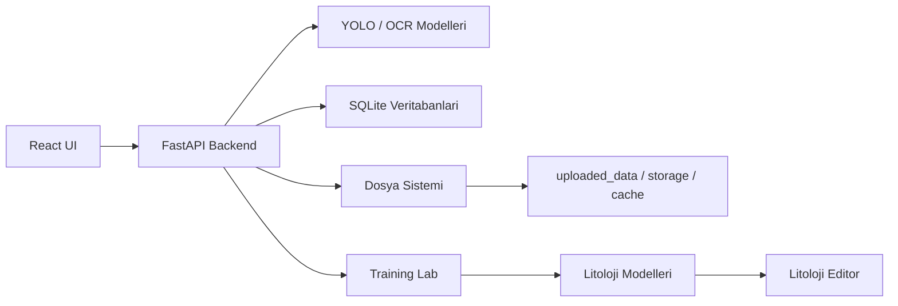

# INOVAKO ESAN Teknik Dokumantasyon

Bu site, `ESANLAST-main` uygulamasinin teknik calisma seklini, ana is akislari ve operasyon notlarini tek yerde toplar. Dokumantasyon; yeni gelistirici, teknik lider, operator ve projeyi devralacak ekip icin hazirlanmistir.

## Dokuman seviyesi

| Alan | Durum |
| --- | --- |
| Mimari genel bakis | Hazir |
| Backend ve frontend runtime | Hazir |
| Jeoteknik, litoloji, training lab, data platform akislari | Hazir |
| API endpoint gruplari ve ornek payloadlar | Hazir |
| SQLite tablo semalari | Hazir |
| Kurulum, deployment ve release sureci | Hazir |
| Ekran goruntulu son kullanici kilavuzu | Sonraki adim |
| Otomatik OpenAPI reference | Sonraki adim |

## Kapsam

| Alan | Icerik |
| --- | --- |
| Backend | FastAPI uygulamasi, model yukleme, router yapisi, tanilama ve kullanici yonetimi |
| Frontend | Vite + React uygulamasi, sayfa rotalari, Redux tabanli durum yonetimi |
| Goruntu analizi | Karot fotograf yukleme, YOLO tabanli tespit, validate ve export akisi |
| Litoloji | Training Lab modelleriyle litoloji segmentasyonu, editor API'si ve manevra uretimi |
| Egitim | AI Vision Lab / Training Lab veri hazirlama, embedding, kumeleme, egitim ve model kaydi |
| Veri platformu | Dataset, snapshot, composition, lineage ve metadata export akislari |

## Ana calisma akisi



## Hizli baslangic

```powershell
cd ESANLAST-main
python run_backend.py
```

```powershell
cd ESANLAST-main\React
npm run dev
```

| Servis | Adres |
| --- | --- |
| Frontend | `http://localhost:5173` |
| Backend | `http://localhost:8000` |
| Dokumantasyon | Mintlify public domain veya `mint dev` |

## Dokumantasyon yayinlama

Bu site GitHub reposundan otomatik deploy edilir:

```text
https://github.com/codecrew-cell/inovako-esan-docs
```

Local degisiklikten sonra:

```powershell
git add .
git commit -m "Update documentation"
git push
```